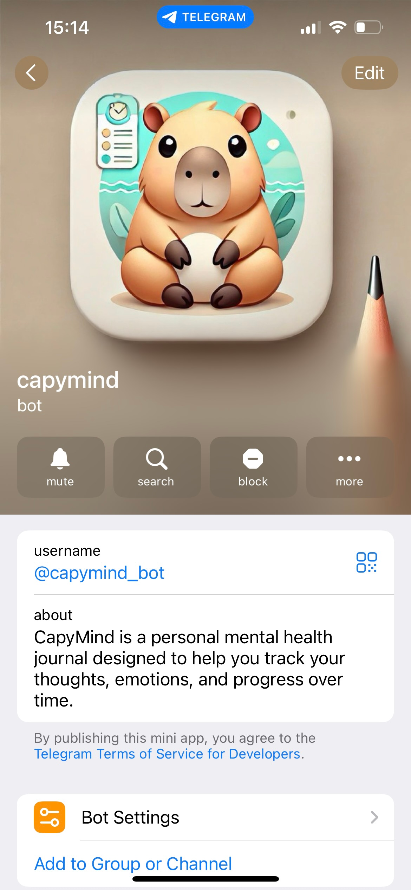

# capymind

[](https://github.com/maximbilan/capymind/actions/workflows/build_and_test.yml)


CapyMind is a personal mental health journal powered by AI, designed to help you track your thoughts, emotions, and progress over time. It provides a simple and secure platform for making journal entries, setting reminders, and gaining personalized therapy insights. Leveraging AI to analyze your notes and dreams, CapyMind empowers you to reflect deeply on your mental well-being. With support for multiple languages and time zones, it seamlessly integrates into your daily routine, offering a personalized space for self-reflection and growth.

# Screenshots

<table>
  <tr>
    <td></td>
    <td></td>
    <td></td>
  </tr>
</table>

# Reference

<a href="t.me/capymind_bot">capymind</a> is available as a Telegram bot

# Commands

## User commands
```
/start - Start the bot
/why - Tells the purpose of the bot
/note - Add a new note
/last - Get the last note
/analysis - Get the analysis of the last notes
/language - Change the language
/settings - Show the settings
/help - Show the help
/version - Show the version
```

## Hidden user commands
```
/missing_note - Ask to put a note from the previous text
/timezone - Change the timezone
/download_data - Download the user data (all notes)
/delete_account - Ask to delete the account
/force_delete_account - Force delete the account
/support - Give feedback or ask for support
/note_count - Count of the current user notes
/sleep_analysis - Sleep analysis of last note
/weekly_analysis - Weekly analysis of the user's journal entries for last week
/reminders - Set reminders
/enable_all_reminders - Enable all reminders
/disable_all_reminders - Disable all reminders
/morning_reminder - Set morning reminder
/enable_morning_reminder - Enable morning reminder
/disable_morning_reminder - Disable morning
/set_morning_reminder_time - Set morning reminder time
/evening_reminder - Set evening reminder
/enable_evening_reminder - Enable evening reminder
/disable_evening_reminder - Disable evening reminder
/set_evening_reminder_time - Set evening reminder time
/skip_reminders - Skip the reminders (during onboarding)
```

## Admin commands
```
/total_user_count - Get the total number of users
/total_active_user_count - Get the number of active users
/total_note_count - Get the total number of notes
/feedback_last_week - Get the feedback from the last week
/stats - Get the stats (total number of users, active users, notes, feedback)
```

# Building

## Prerequisites

1. Install `Go`
2. Tunnel ex. `ngrok`

## How to run locally

1. `go build`
2. Run `ngrok` or other tunnel
3. Set up `CAPY_CLOUD_FUNCTION_URL` as a ENV variable with the tunnel url
4. `chmod +x ./scripts/setup_telegram.bot.sh`
5. `./scripts/setup_telegram.bot.sh` (Set up a Telegram token)
6. `go run cmd/main.go` to run the server

# Scripts

More information <a href="./docs/SCRIPTS.md">here</a>
